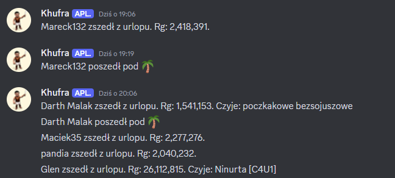
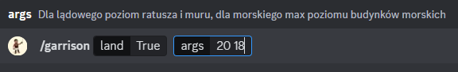
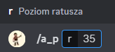
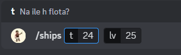
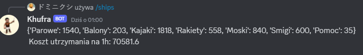

# Bot na discord

Główne działanie to analizowanie rankingu graczy w top 250 i patrzenie czy któryś nie wróci z urlopu.

### Przykładowe użycie komend do gry Ikariam

- assign - przypisuje wrogi sojusz do nazwy skarbonki. Przy wypisywaniu napisze do kogo należy. W przypadku gdy nie może znaleźć nazwy skarbonki w pamięci może oznaczać, że jej nie ma w rankingu albo został popełniony błąd przy wpisywaniu nazwy.

- update - to działa podobnie jak assign tylko, że czyta z pliku kolejne dane i przypisuje do konkretnej skarbonki.

- garrison - wypisuje limit garnizonu lądowego lub morskiego

- a_p - action points. Wypisuje ilość punktów akcji dla właściciela miasta i osób trzecich w zaleźności od podanego poziomu ratusza

- ships - wypisuje skład floty na podany czas oraz jej utrzymanie zależne od poziomu badań

