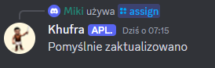

# Bot na discord
### Przykładowe użycie komend do gry Mobile Legends Bang Bang

- hero_info - wypisuje informacje o bohatrze, tzn: jego wszystkie umiejętności wraz z opisami co robią.

- heroes (Trzeba wybrać co najmniej 1 opcję)

I na przykład dla tier SS wypisze wszystkich aktualnie najlepszych bohaterów.

- item_info - wypisuje informacje na temat podanego itemu

### Przykładowe użycie komend do gry Ikariam

- podkupowacz - wyznacza konto na które należy się zalogować, aby mieć szansę podkupić flotę przeciwnika

- garrison - wypisuje limit garnizonu lądowego lub morskiego

- a_p - action points. Wypisuje ilość punktów akcji dla właściciela miasta i osób trzecich w zaleźności od podanego poziomu ratusza

- ships - wypisuje skład floty na podany czas oraz jej utrzymanie zależne od poziomu badań

